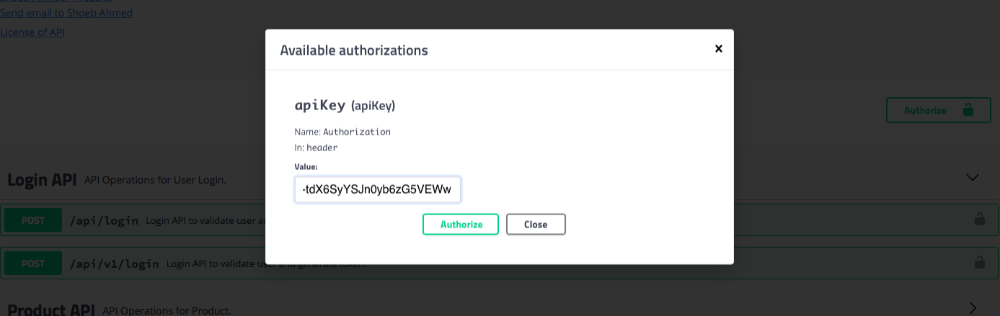

# Global Fashion Group - Assignment

This assignment is prepared for Global Fashion Group. Fashion is close to everyone's heart :smirk:, so I have tried my level best code doesn't look ugly. Clothes what we wear gives us confidence and positive energy. I really like this statement, GFG is a fashion company with heart and appreciate. Also, it was nice you have shared the expectation very clearly for this assignment. I have used Eclipse on Mac to build this micro service and docker to run this application. All details is provided in this readme.

### Contents
  1. [Design Consideration](#design-consideration)
  2. [Assumption](#assumption)
  3. [Ecosystem and Library](#ecosystem-and-library) 
  4. [How to build and run GFG μS](#ecosystem-and-library)
 

### [Design Consideration](#design-consideration)
  I have used Spring Boot Microservice's to build CRUD API for Products. API also supports batch creation and fetch. Mongo Database is used to store persistent data, and docker is used for local development and also for deployment. Swagger is incorporated to quickly verify this application. I could have used Caching to make this solution better. All API are versioned. Google Code style plugin for Eclipse is used to format code while developing.

  ##### JWT Authentication
    Lets start with Security first :neutral_face: JWT is used to secure this application, at this
    moment I have harcoded user who can access GFG μS.
  	   User Name : gfgadmin
  	   Password  : password
    For this assignment I have assumed only admin or user of Seller Center can can access these API's.
    If these API needs to be exposed to Web users (Where they only need access to Read API) than we can
    extend this solution to support role based permission by @PreAuthorize annotation. CSRF cross token 
    authorization is disabled. GFG μS runs stateless and no state is stored or chained. In the next
    section I will show you how can verify this API.
  
  ##### Pagination
    PagingAndSortingRepository is used to support pagination. I have used Repository to return
    Page<?>. Pagination is supported for Get request with query parameter. I have used headers to send 
    back the information to client to make this solution simple. There can also be an option to send this 
    information in DTO. I have not used existing Pageable as request param, as it was introducing parameter
    which was making the API look complex
    
      * page-number: 0 				Denotes the page number (zero based index)
      * total-pages: 1 				Total pages for this request

  ##### Sorting
    As per requirement price, brand and color are suitable. You will have to specify a price.asc if 
    you want to sort by price ascending order. If you need to descend order it will be price.desc , 
    Default field is the price and default sorting order in ascending.

  ##### Unit and Integration Testing
    MockMvc is used for Unit and Integration Testing. JUnit version 5 is used to test GFG μS. Unit 
    testing covers basic API  testing with JSON. Integration testing is used to verify basic and 
    additional requirements of this assignment.

### [Assumption](#assumption)
    I have assumed to use basic Spring Boot to build this assignment. Due to time consideration, I was 
    unable to write comments in Java file, but named variable and function to conveys its purpose. To 
    use this application I have hardcoded user name and password. JWT works fine and restrict any 
    unauthorized access. GFG μS runs on port 8081

### [Ecosystem and Library](#ecosystem-and-library)
  Java 8
  Mongo DB
  Eclipse IDE on Mac.
  Maven to build this GFG μS.
  Docker to package and run this GFG μS.
  Swagger to document and run API.
  Modelmapper to convert DTO to Domain and vice versa.
  Lombok to reduce boiler code for getter, setter and constructor.

### [How to build and run GFG μS](#ecosystem-and-library)
  
  Once code is cloned on your local system, open terminal(command) window and go to gfg-assignment
  folder and start local mongo db which will run on docker.
  
    docker run --name=mongo-local -p 27017:27017 -d -v ~/data:/data/db mongo:3.6
  
  Build project with Maven, this command will also run integration test which need mongo database.
    
    mvn clean install
  
  Once the product build result in success, you will have to stop local mongo image.
  
    docker stop mongo-local
  
  After this run μS with docker compose command.
  
    docker-compose up -d
  
  μS runs on port 8081 and accessible from this URL. In case you are unable to access with IP you can 
  try with localhost. μS will load staging data for three products, to test API's. Please follow below 
  steps docuemented to use this API.
  
    http://127.0.0.1:8081/swagger-ui.html
   
 Finally to shutdown this μS you can run following command.	
	
    docker-compose down
    
Step 1 : On Swagger Page, you can click on Login API and choose either version to Login. 

Step 2 : Click on Try it Out button, to login and get a bearer token.

Step 3 : Enter User name as gfgadmin and Password as password and click on Execute button

Step 4 : From Response header copy the bearer token.

Step 5 : Scroll up a bit and click on "Authorize" button. 

Step 6 : In Popup window enter token as value and hit Authorize. 

Step 7 : Click on Product API

Step 8 : Click on API to get Product, enter values, and click on Execute.
   * Page Number : 0
   * Page Size   : 50
   * Search String : Let it be blank
   * Sort By : price.asc

Step 9 : You can verify response.

You can now repeat from from Step 6 to Step 9 to verify any of the other API's.
